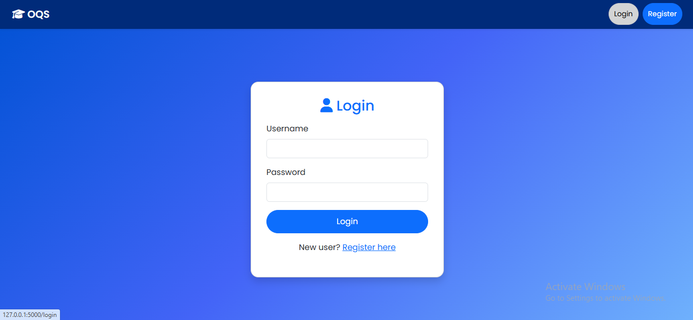
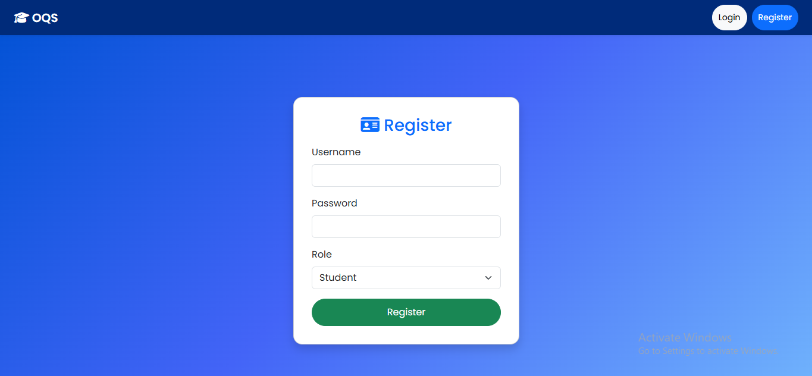
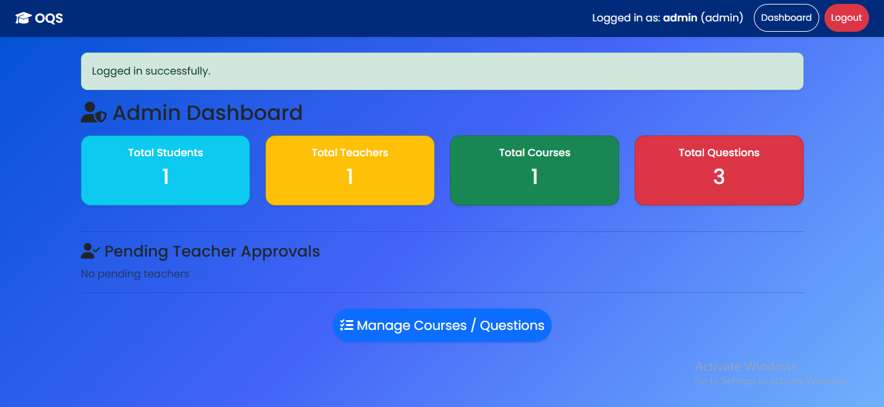

<!-- PROJECT LOGO -->
<p align="center">
  <a href="#">
    
  </a>

<h2 align="center">🎓 Online Quiz System (OQS)</h2>

## 🔰 Badges & Tech Info


---

## 🚀 Key Features

| Role | Capabilities |
|------|-------------|
| 👑 Admin | Approve teachers, manage courses & questions, view student analytics |
| 🧑‍🏫 Teacher | Create courses, add MCQs, view student attempts |
| 🎓 Student | Register, attempt quizzes anytime, view results history |

✨ Fully automated scoring and dashboard insights included!

---

## 🖼️ UI Preview

### 🔐 Login & 📝 Register Pages
<p align="center">
  
  
</p>

### 🧑‍💼 Admin Dashboard & 📚 Question Management
<p align="center">
  
  
</p>

---

## 🎯 Tech Stack

🔹 **Frontend:** HTML, CSS, Bootstrap 5, FontAwesome  
🔹 **Backend:** Python Flask  
🔹 **Database:** SQLite  
🔹 **Authentication:** Flask-Login  
🔹 **Template Engine:** Jinja2  

---

## 🛠 Folder Structure

OnlineQuizSystem/
│── app.py
│── instance/
│── static/
│ ├── style.css
│── templates/
│── screenshots/
│── README.md
└── venv/

---

## ⚙️ Installation & Usage

```bash
# Clone Repo
git clone https://github.com/pavithraB-wec/OnlineQuizSystem.git
cd OnlineQuizSystem

# Create Virtual Environment
python -m venv venv
venv\Scripts\activate   # Windows

# Install Dependencies
pip install flask flask_sqlalchemy flask_login

# Run Application
python app.py

Open in browser:

http://127.0.0.1:5000/

Username: admin
Password: admin123

📝 License

Distributed under the MIT License.
See LICENSE for more information.

🔍 Project Keywords (SEO)

python flask quiz mcq online exam project student dashboard
admin panel teacher portal sqlite bootstrap

<p align="center"> Made with ❤️ by <b>Pavithra</b><br> If you liked this project ⭐ please star the repository! </p> ```
